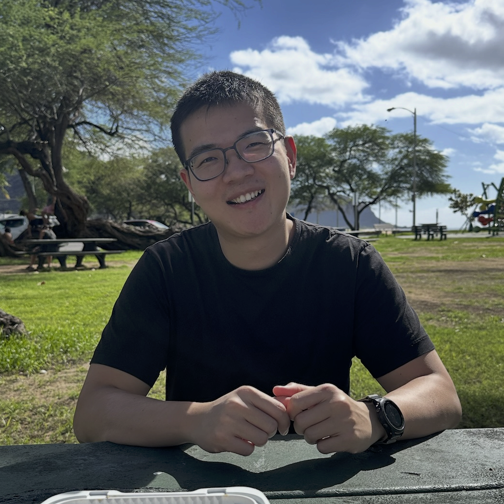

Affiliated with the Department of Pharmacology at the Medical School of the Undisclosed University, we are a group of interdisciplinarily quantitative researchers aiming to change the way drugs are developed and prescribed.

Get involved by [joining](/pages/careers), donating, [collaborating (for academics)](mailto:y@yqw.io), or setting up a _pro bono_ [consulting session (for companies)](mailto:y@yqw.io) .

**🔬Scientific mission.** We automate the decision-making processes in drug discovery and precision medicine using unified AI and physical modeling.

Areas of interest include, but are not limited to:

- ⚙️ <u>AI-accelerated physical modeling.</u> Statistical mechanics and information theory are one tale told in two languages.

- 💡 <u>Physically inspired AI.</u> Foundation models of, by, and for chemists are needed to model the uniquely small, noisy, and heterogeneously structured data in drug modeling.

- 🧠 <u>Decision-making platforms for drug discovery and precision medicine.</u>

Let's talk if you have other big ideas remotely related to AI and/or drug discovery and/or precision medicine.

**👩‍🏫Educational mission.**
To change the way we make every drug in the future, 
we cultivate the next generation of scientist-entrepreneurs, 
or with the risk of sounding cheesy, professor-founders.
We will also support your growth into leaders in another setting, such as
corporate or govermental.

**🏘️Social mission.**

**🥂Members,** sorted reverse-chronologically.

|-|-|
|| **Yuanqing Wang**   王源清    M.B.A., [M.F.A.](https://osf.io/nq4sx/), [Ph.D.](https://proquest.com/docview/2789704784)   he/him/his    |
|\<your photo here\>| [join us](/pages/careers)|

**🌎Land acknowledgement.** The land on which the University, and thereby we, operate is---without putting too fine a point on it---_stolen_.
See the official acknowledgement here.

**☮️Inclusion statement.** Situated at the last frontier of humanity on this once civilized continent, we try our best to make academia a welcoming place for all, regardless of gender, age, sexual orientation, race, ethnicity, political orientation, national origin, able-bodiedness, family commitments, and socioeconomic background.
We _especially_ welcome scientists from groups oppressed or marginalized in our neighboring country/countries to work with us.
We also welcome researchers who took an untraditional career path.
